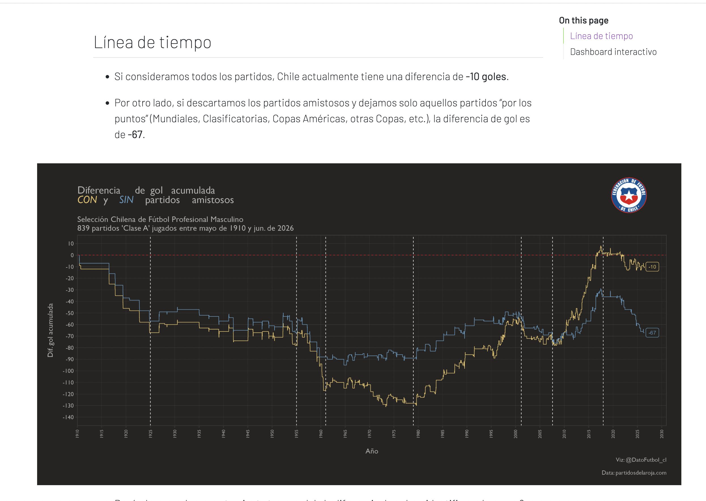

# ¿Fue la Generación Dorada la mejor generación de La Roja? #
## Síntesis del proyecto: 
Muchos creen que la Generación Dorada fue la mejor generación de futbolistas en la historia de la Selección Chilena o al menos esa es la idea que creemos está muy instalada en la cultura futbolera en Chile. 

Si bien entendemos que hay razones claras para pensar eso, como que Chile consiguió dos Copas América seguidas en 2015 y 2016, eso tampoco nos dice mucho, ya que ¿fue la mejor selección o solo la que consiguió más títulos importantes? Esto abre una investigación interesante, ya que una generación puede tener más títulos, pero otra podría haber tenido mejor porcentaje de victorias, mejor diferencia de gol, mayor cantidad de partidos ganados, mejores resultados contra grandes selecciones, mejores participaciones en mundiales, mayor cantidad de jugadores con muchos partidos, jugadores con más goles e incluso más jóvenes, y ahí es donde aparecen los datos.

Entendiendo a la generación dorada como los jugadores entre 2007 y 2017, por lo tanto, pretendemos dividir las distintas generaciones de la Roja para estudiar y comparar sus rendimientos hasta la generación actual. Algunas de las variables a estudiar son el porcentaje de victorias por generación, la diferencia de goles, es decir, no solo si una generación ganaba más partidos, sino por cuántos goles ganaba. Además, proponemos separar entre rivales difíciles y más fáciles o entre partidos oficiales y amistosos, ya que entendemos que un amistoso contra una selección menor no debería pesar igual que: Eliminatorias, Copa América, Mundial, Copa Confederaciones. Por eso tendríamos: Rendimiento total vs. rendimiento competitivo, y creemos que ahí probablemente aparezcan diferencias interesantes.
## Pregunta de investigación: 
¿Fue la Generación Dorada el período de mayor rendimiento deportivo en la historia reciente de la Selección Chilena? ¿La Generación Dorada fue superior solamente por sus títulos o también por sus resultados estadísticos?
## Antecedentes del tema:
Encontramos que ya existen investigaciones publicadas que, sumando los números de las ediciones de Copa América 2015, 2016 y 2019, la selección registra más victorias y más goles que en el total de las ocho ediciones disputadas entre 1993 y 2011. Pero nosotros queremos ir más allá, es decir, no solo quedarnos con la Copa América, sino comparar el rendimiento general de generaciones.
https://chile.as.com/chile/2019/06/22/futbol/1561238933_795389.html 
## Datos: 
Sabemos que necesitamos una enorme cantidad de datos y además ordenarla, pero el análisis se concentrará principalmente en el período 1990–2026, debido a la disponibilidad y comparabilidad de los datos. El partir desde 1990 tiene una justificación y, además de que no es posible procesar tantos datos en tan poco tiempo, partir desde 1990 nos permite comparar la generación que llevó a Chile al Mundial de Francia 1998 con la posterior Generación Dorada.

La mayoría, por no decir todos, los datos ya los tenemos debido a que encontramos esta página: https://www.partidosdelaroja.com/1970/01/estadisticas-de-la-seleccion-chilena.html que nos permite ver información de hasta los primeros partidos clase A de Chile en 1910 y tiene registros de 839 partidos masculinos.

Para probar nuestra hipótesis, necesitamos datos que existen, son públicos y confiables, ya que, debido a la popularidad del fútbol, la mayoría de los partidos son televisados, con público, y las distintas organizaciones como CONMEBOL, FIFA, ANFP, etc., registran los datos de los partidos, por lo tanto, los datos existen, pero nos falta ordenarlos. Lo que nos faltaría es cerrar el número de datos a utilizar, pero los que tenemos más definidos son (de acuerdo a cada base de datos dividida por generación): 
1. Jugadores de la generación 
2. Partidos ganados 
3. ¿Por cuántos goles ganaron?
4. ¿Contra quién jugaron? 
5. ¿Qué tipo de enfrentamiento fue? 
6. Edad de los jugadores

Lo que no faltaría es delimitar desde qué año a qué año vamos a considerar la generación dorada y desde ahí establecer la delimitación de las demás generaciones. 
## Preguntas a responder: 
¿Qué generación hizo más goles? ¿Qué generación ganó más partidos? ¿Qué generación tuvo un mejor rendimiento considerando sus edades? ¿Cuál fue la mejor generación?
## Historia visual: 
Decir que vamos a investigar a la Generación Dorada no es ninguna novedad, pero nuestro proyecto no es solo eso, sino que busca cuantificar y comparar el rendimiento de distintas generaciones de la Roja mediante indicadores estadísticos comunes, poniendo a prueba la idea instalada de que la Generación Dorada fue la mejor de la historia. La investigación no se limitará a títulos, sino que incorporará resultados, diferencia de gol, rendimiento frente a distintos niveles de rivales, partidos oficiales y edad de los jugadores. 

Además, como entendemos que tendremos varios números, creemos que eso es una oportunidad para poder tener distintos elementos visuales, por ejemplo, al hablar de generaciones, se me ocurre una línea de tiempo, al igual que con la comparación de diferencia de gol, como esta

Referencia: https://www.datofutbol.cl/blog/goles-partidos-seleccion-chilena/index.html 

También, como el fútbol tiene muchos elementos visuales como balones, arcos, la cancha, podemos usarlos para agregar información, algo como un GIF así: https://media.giphy.com/media/v1.Y2lkPTc5MGI3NjExenliZ2wwNzZhdjd2b2I5Z3B6azhveDB2azFycHhoN3Y2dzU2aTV3aiZlcD12MV9naWZzX3NlYXJjaCZjdD1n/Q7jD6uIQTZtO0wb2uZ/giphy.gif pero que cuando alguien haga clic en el balón, se agrande y diga la información.

## Resultados: 
Lo máximo que se puede contar es toda la historia chilena del fútbol en cifras y comparativas, lo mínimo que se puede contar es cuál fue el rendimiento de la generación dorada. Lo que nosotros queremos investigar es si esa generación fue realmente la mejor y cómo estuvo el rendimiento de las otras en comparación, analizando más allá de los títulos ganados y de la Copa América.
